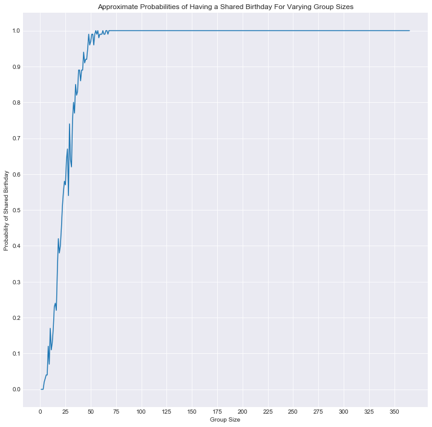

# Teacher Notes

## Introduction

This is another recommended first day activity. Remember that the most important aspects are to build a collaborative environment where students are problem solving and actively working together. This activity is meant to help facilitate student interactions as an ice breaker as well as provide an opportunity for problem solving and discussing statistics and introductory programming concepts.

## Suggested Outline for the Day

* Getting Started with Data Science (45 - 90 minutes)
* **This (or another) Class Programming Exercise** (1 hour +)
* Other Introductory Activities - Blogging, Getting Acquainted, Discussing Imposter syndrome etc. (time will vary)
* Learn - Individual Work Time (remainder of day)

## Lesson Outline
* Problem Statement (3 minutes)
    * Introduce the problem and direct students to take a few minutes to mull it over.
* Paired Discussions (5-10 minutes)
    * After giving students a few minutes to think on their own (where they can flesh out their own intuitions), have students pair up and discuss their thoughts. This provides an opportunity for student interaction and comparing/contrasting initial thoughts.
* Class Discussion
    * Bring the class back together and lead a discussion regarding various approaches to the problem.
    * Class survey (optional, but potentially a fun ice breaker activity) survey student's birthdays and see if there are any duplicates in the class. Alternatively, you can also facilitate this activity at the beginning of the lesson and ask students to try and silently line up in order of their birthday's from Jan 1st to Dec 31st.
    * Programming Simulation&mdash;move the discussion towards a programming mindset, probing students for how they could create a simulation to model this scenario. Some leading preliminary questions might include:
        * How can we represent a person's birthday? Which representation is easiest?
            * Possible answers include: MM-DD, Month Day, etc.
            * The easiest is actually probably simply a number 1-365 (or 366 if we include the possability of leap years)
        * How can we store these birthdays? (a list is most natural)
        * How can we check if we've already seen this birthday? (conditional if statement, list comprehension or loop)
        * How can we repeat this simulation to observe the probability?
        * How can we display this information?

## Prework

No prior prework is required for this lesson.

## Postwork

Lead the class through further orientation activities or direct their attention to learn for individual or paired time to work on introductory materials there.

## Materials

* Student version of this slide deck: Getting Started with Data Science

# The Birthday Problem

How many people do you need to have at least a 50% chance that 2 people have the same birthday? How many for an 80% chance? How many for a 100%?


```python
# Teacher Notes
# This solution preview several aspects that will be foreign to students including numpy.
# Nonetheless, this preview will help frontload concepts to be introduced in the near future.
# Lead students through this code snippet provides many
# Potential solution:

import numpy as np
import seaborn as sns
import matplotlib.pyplot as plt
%matplotlib inline

group_sizes = range(1,366)
group_probs = []
#Explore various group sizes
for group_size in group_sizes:
    #Simulate 100 random scenarios to estimate the probability
    has_duplicates = 0
    for simN in range(100):
        birthdays = np.random.choice(range(1,366), group_size)
        if len(set(birthdays)) != len(birthdays):
            has_duplicates += 1
    prob = has_duplicates / 100 #Set the estimated probability for the group size 
    group_probs.append(prob)
sns.set_style('darkgrid')
plt.figure(figsize=(12,12))
plt.plot(group_sizes, group_probs)
plt.title("Approximate Probabilities of Having a Shared Birthday For Varying Group Sizes")
plt.xlabel('Group Size')
plt.yticks([i/10 for i in range(11)])
plt.xticks(range(0, 375, 25))
plt.ylabel('Probability of Shared Birthday')
```


    Text(0,0.5,'Probability of Shared Birthday')




